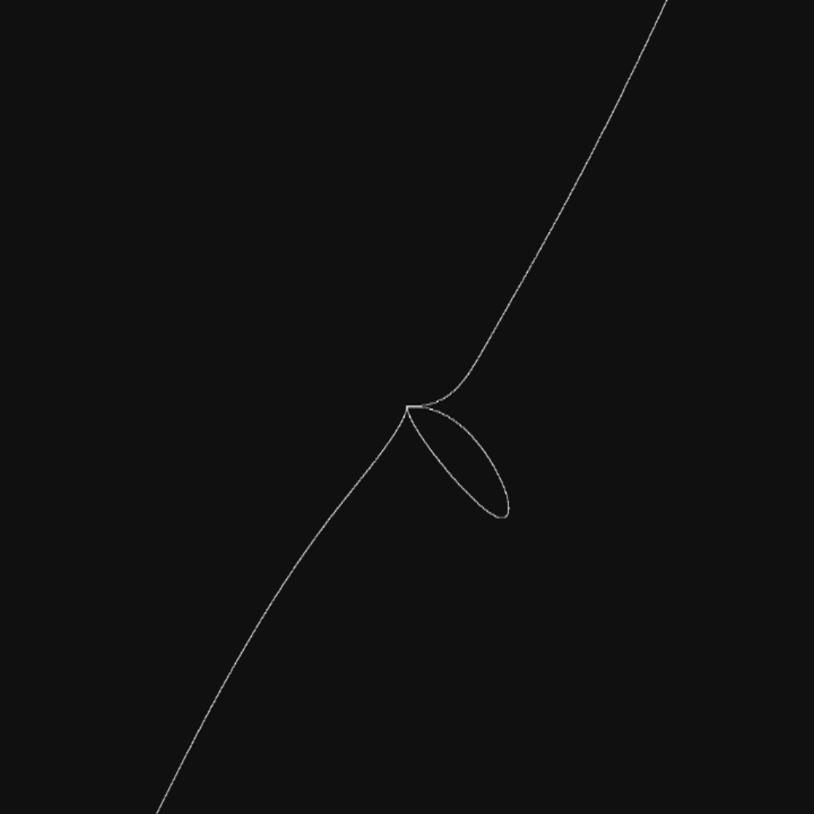

# Relatório: Problema 3 - Visualização de Objetos Implícitos 

## Resolução do problema 

Para representação visual, como estabelecido pela proposta do trabalho, foi utilizada a representação por decomposição espacial, dividindo o plano em voxels cada vez menores, de acordo com o nível de refinamento da visualização. Voxels esses que são armazenados numa estrutura de árvore quaternária, em que a raiz é o quadrado que ocupa todo a janela da visualização, os quatro filhos de um nó são os quatro quadrantes que formam o voxel pai e o grau representa o nível de refinamento (precisão) da visualização do objeto. Caso exista algum ponto da função passando pelo quadrante ele é pintado e, caso a precisão seja aumentada, continuará sendo dividido. Na visualização 0, apenas os quadrados que se encaixam na descrição anterior são pintados, já na visualização 1, também é feito o contorno de todas os outros nós da árvore (seguindo um esquema de cor estabelecido para criar um degradê), por fim, na visualização 2, os quadrados externos à função são pintados de azul e os internos, de vermelho. À medida que a árvore foi construída, foi percebido que seria necessário retornar listas de nós da mesma. Tendo em vista que a lista encadeada não precisa de tamanho predeterminado e pode ser feita de maneira a ser indexável - além do código já ter sido feito por ambos os integrantes da dupla para o trabalho anterior, economizando muito tempo -, foi acordado que a sua utilização era a mais apropriada para a necessidade citada. 

Para fazer a conversão das coordenadas cartesianas para os pixels da janela do PyGlet e, assim, orientar a representação visual, foi criada a função 1, da mesma forma, foi criada a sua função inversa, que transforma coordenadas da janela em coordenadas cartesianas, representada pela função 2. 

1. Função 1: $(x + 4) \times 128$ 

2. Função 2: $\frac{x}{128} - 4$ 

Visando facilitar os cálculos, a dupla optou por utilizar uma janela de tamanho 1024x1024, por ser uma potência de 2 que ainda cabe na maioria nos monitores e, caso seja cortada, não prejudica a visualização dos objetos na aplicação. Assim, foi estabelecido um nível de refinamento máximo de 10, uma vez que 2¹⁰ = 1024, fazendo com que uma precisão maior ocasionasse a criação de um quadrado menor que 1 pixel. 

### Participação e datas 

Após o entendimento das nuances do problema e das demandas, foi primeiro discutido os desafios que seriam enfrentados e possíveis soluções. A partir do momento que o raciocínio para a resolução estava claramente montado para ambos os alunos, foi feita uma reunião de 5 horas na terça-feira dia 29/11, onde todo o código foi estruturado. Infelizmente, como o código não rodava no computador de Luísa Coelho até a manhã de quinta-feira, 01/12, a maior parte do debug foi feita por Lucas assincronamente, acontecendo outra reunião na quarta-feira dia 30/11 para debug em dupla. Depois disso, foram feitos apenas pequenos ajustes ao código para melhorar a interação do usuário com a aplicação aberta, além da escolha das cores e das funções e escrita do relatório. 

## Algoritmos e análise da complexidade 

### Verificar a presença de ao menos um ponto 

A verificação da existência de um ponto do objeto dentro de um quadrado é feita na criação do nó da árvore a partir da análise das coordenadas cartesianas de cada um dos quatro vértices do quadrado de acordo da equação do objeto escolhido, cujos resultados sempre se encaixarão em um dos seguintes casos: 

1. resultados maiores que zero → o quadrado é interno à função 

2. todos os vértices são menores que zero → o quadrado é externo à função 

3. existe pelo menos um vértice cujo sinal é diferente → a função passa pelo quadrado 

4. precisão <= 1 → a função passa pelo quadrado 

a existência ou não de um ponto naquele nó é guardada como atributo dele, para ser acessado futuramente por outras funções, diminuindo a complexidade delas. É importante acrescentar que esse método, apesar de abranger a grande maioria dos casos, pode gerar descontinuidades na representação de determinadas funções, visto que, não é 100% eficaz na detecção da existência de pelo menos um ponto, falhando caso a função entre e saia pela mesma aresta do quadrado ou a linha nasça dentro da função, por isso, existe o caso 4, apresentado acima. 

No que diz respeito à complexidade, a verificação da presença de ao menos um ponto em um quadrado é O(1), o que torna a verificação de n quadrados O(n). 

### Busca por folhas 

É um processo recursivo que retorna uma lista encadeada com as folhas das 4 subárvores de um nó, cujo caso base é o nó atual ser uma folha, ou seja, ser uma subárvoe vazia. Nesse caso, o algoritmo retorna uma lista com apenas aquele elemento. Desse modo, aplicando-o à raiz da árvore, obtém-se uma lista com todas as folhas da árvore. 

No que diz respeito à complexidade, como todos os nós da árvore são checados apenas uma vez, tem-se um algoritmo O(n), que cresce linearmente de acordo com o número de nós. 

### Busca por folhas que possuem pelo menos um ponto 

Esse algoritmo utiliza a lista gerada pela função anterior e verifica as folhas encontradas uma a uma, checando o atributo que indica a presença de um ponto e adicionando o nó da árvore a uma nova lista se for o caso. Tendo em vista que a busca por folhas é O(n) e esse algoritmo também possui crescimento assintótico linear, mantem-se a complexidade de O(n). 

### Redução de precisão 

Utilizando um processo similar à busca por folhas, esse algoritmo chama uma função que cria uma lista com os nós de grau = precisão - 1 e, para cada um deles, substitui os filhos por nós vazios. Assim, como a função chamada é O(n) e esse algoritmo também, mantem-se o crescimento assintótico linear. 

### Aumento de precisão 

Nesse algoritmo, é acessado cada nó da lista gerada pela busca de folhas que possuem pelo menos um ponto e criados 4 filhos para cada um. Durante a criação de cada um dos nós filhos, como dito anteriormente, já é verificada a passagem da função pelo quadrado correspondente e essa informação é salva como um atributo do nó da árvore. No que diz respeito à complexidade, temos: o melhor caso, em que não há solução real no intervalo definido para visualização na janela do PyGlet e, portanto, não haverá subdivisões, situação na qual o algoritmo é O(1); o pior caso, onde o conjunto solução do objeto contém todo o plano definido pela janela, o que resulta em todos os quadrados serem sempre subdivididos e a complexidade ser O( $2^{2n}$ ). 

## Utilizando o programa 

### Inicialização 

O programa deve ser inicializado pelo terminal, chamando a função main e passando 3 parâmetros iniciais: 

1. o objeto a ser visualizado (número de 0 a 6) 

2. o tipo de visualização desejada (número de 0 a 2) 

3. a precisão ou refinamento inicial (número de 0 a 10) 

Caso algum parâmetro não seja passado ou não esteja dentro do limite estabelecido, o programa exibirá mensagens de texto para que o usuário digite novamente. 

De acordo com as especificações do trabalho, todos esses parâmetros podem ser atualizados durante a visualização, não sendo necessário terminar o programa e chamá-lo novamente. Para entender como esses parâmetros são manipulados com a aplicação aberta, veja o próximo tópico, "Controles". 

### Controles 

As teclas que podem ser utilizadas são as seguintes: 

 

Essas teclas foram escolhidas para fornecer a interatividade mais intuitiva e facilitada possível. A seguir, veja a função de cada uma: 

 

### Funções utilizadas 

Foram escolhidas 7 funções para compor o trabalho, das quais quatro foram disponibilizadas pelo professor como exemplo e três foram criadas pela dupla. Todas as funções feitas pelos alunos foram descobertas a partir da manipulação de expressões utilizando operações escolhidas ao acaso entre diferentes potências das variáveis, e visualizando os impactos de cada operação através da calculadora gráfica GeoGebra e adicionadas ao trabalho por serem esteticamente agradáveis. Segue uma tabela com o nome, as visualizações e a equação de cada objeto: 

| Visualização | 0 - Laço | 1 - Rotatória | 2 - Cardioide | 3 - Losango |4 - Ventilador | 5 - Gaspar | 6 - Chinchila | 
| :---: | :---: | :---: | :---: | :---: | :---: | :---: | :---: | 
| 0 |  |  |  |  |  |  |  | 
| 1 |  |  |  |  |  |  |  | 
| 2 |  |  |  |  |  |  |  | 
| Equação | $x⁷ - y⁵ + x²y³ - (xy)²$ | $x² + y² + xy - \frac{(xy)²}{2} - 0.25$| $(x² + y² - 4)³ - x² \times y³$ | $\lvert x \rvert + \lvert y \rvert - 2$| $x² - y² + y³ - x³ + (xy)² + (xy)³$ | $x⁶ - y⁵ + x⁴ + y³ - x²$ | $\frac{x²}{y² + 2⁻¹⁰}  \times \sin(1.6 \times (-\lvert x \rvert - 0.8)) + y² - x²\times \sin(1.6(y - 0.8)) - 1$ | 
